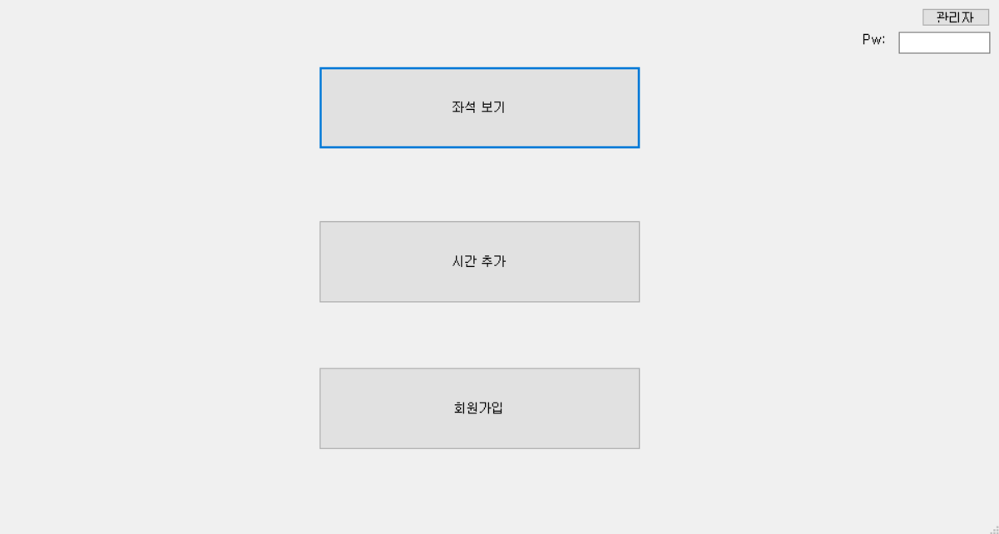
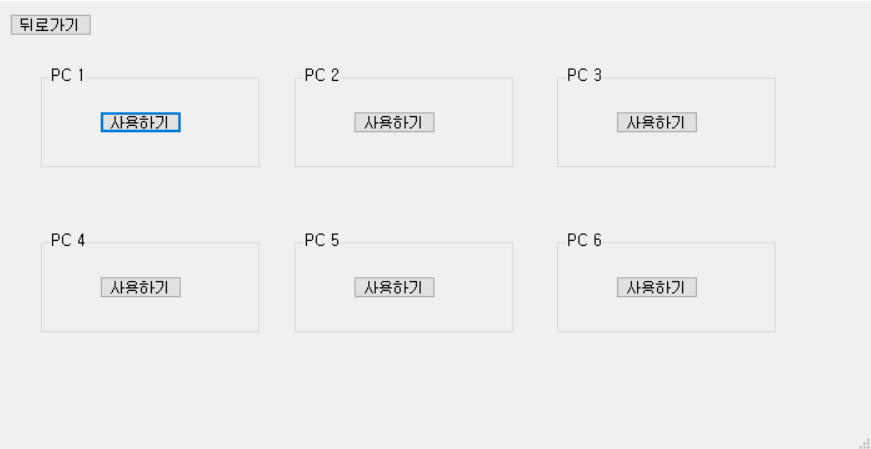
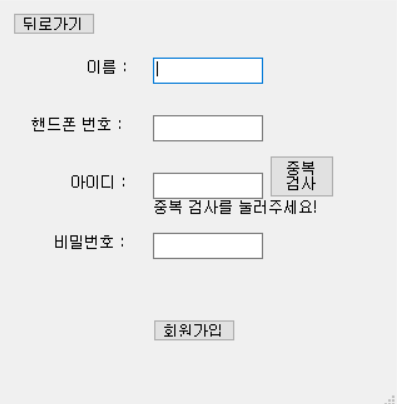
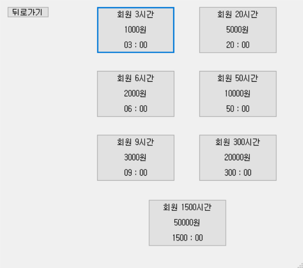

# Management_InternetCafe
광주소프트웨어마이스터고 2학년 1학기 응용프로그래밍 과목 수행평가를 위해 C# Winform으로 만든 PC방 관리 프로그램입니다. 

2인팀으로 진행했고, 제가 C# Winform을, 친구가 Database를 담당했습니다.

## 메인화면
그냥 평범한 메인화면입니다.  오른쪽 위에 패스워드를 입력하면 관리자 화면으로 넘어가서 사용자들의 정보(남은 시간, 누적 결제액 등)를 확인할 수 있습니다. 

## 좌석보기 화면
사용하기 버튼을 누르면 아이디와 비밀번호를 입력하고, 사용 종료 버튼을 누르면 사용시간만큼 남은 시간이 차감됩니다. 
하나의 계정으로 여러 자리에서 사용 할 수 없습니다.  
남은 시간이 0이 되면 자동으로 종료됩니다.

## 회원가입 화면
중복검사를 하지 않거나, 입력하지 않은 칸이 있다면 회원가입이 완료되지 않습니다. 

## 시간추가 화면
버튼을 누르고 아이디를 입력하면 시간이 충전됩니다. 

